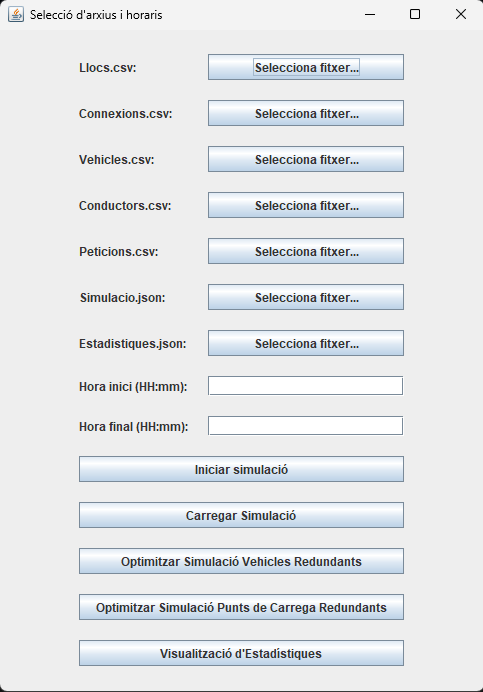
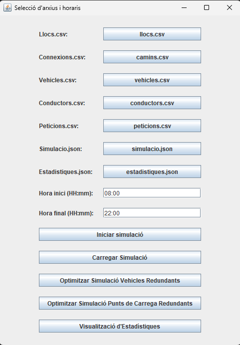
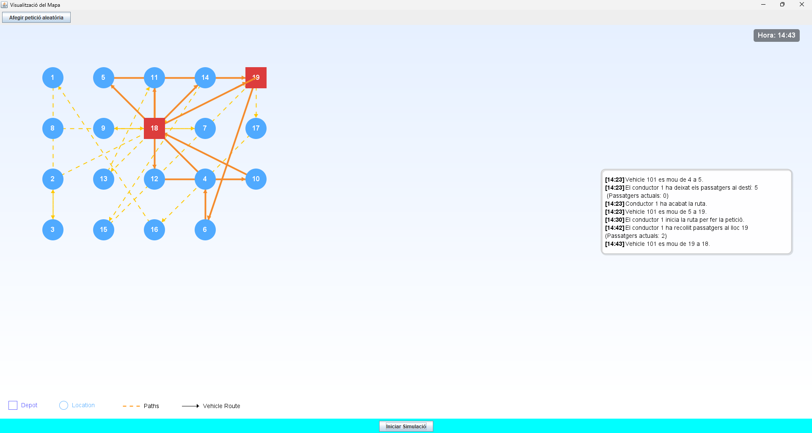
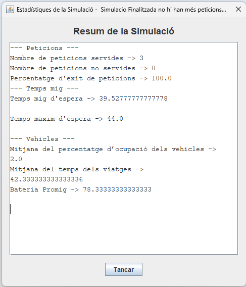
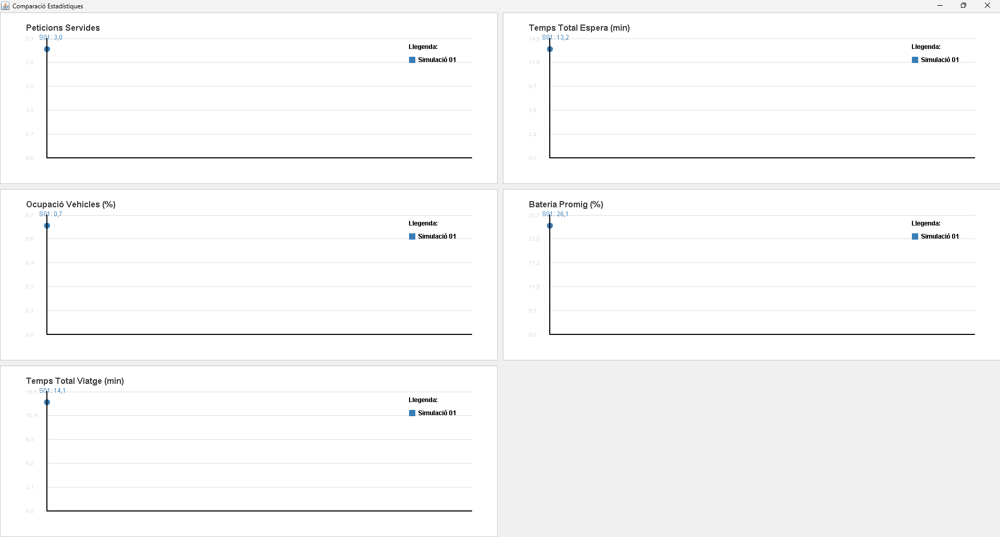
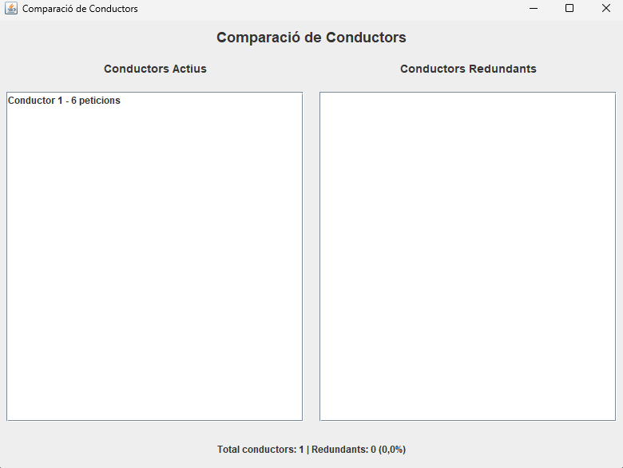
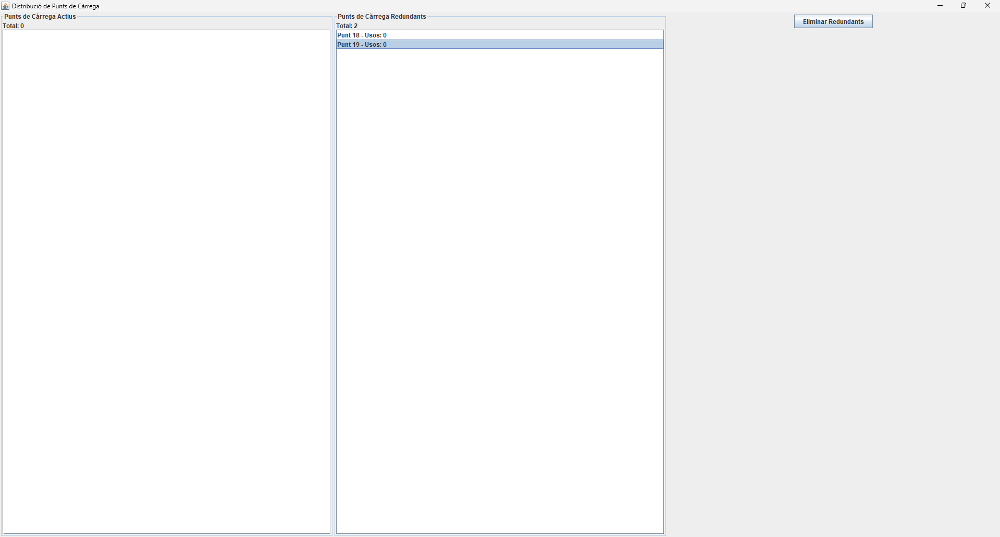

# 🚖 Taxi Simulator · Optimització de Rutes i Realitat Augmentada

[](https://classroom.github.com/a/iUsMBQQV)
[](https://classroom.github.com/open-in-codespaces?assignment_repo_id=18574297)

**Taxi Simulator** és un sistema avançat de simulació de transport urbà que combina algorísmia d'optimització d'alt rendiment amb una interfície visual d'última generació. El projecte se centra en la gestió logística de flotes en temps real, integrant funcionalitats de **Realitat Augmentada (AR)** per a una visualització immersiva de les rutes.

---

## 🚀 Tecnologies i Fonaments


* **Optimització en Temps Real:** Implementació d'algorismes de cerca de camins i gestió de trànsit.
* **Interfície Gràfica:** Desenvolupada completament amb JavaFX per a una experiència fluida.
* **Visualització AR:** Mòdul de Realitat Augmentada per a la inspecció detallada de la simulació.

---

## 📺 Demostració en Vídeo

Descobreix com funciona el motor de simulació i l'optimització de rutes en moviment:

https://github.com/IGprojects/Taxi-Simulator/raw/main/assets/video_simulacio.mp4

---

## 📸 Captures de la Simulació

### 🗺️ Interfície Principal i Mapes
| Dashboard de Control | Sistema de Rutes |
| :---: | :---: |
|  |  |

### 🛠️ Gestió i Algorísmia
| Optimització de Trànsit | Anàlisi de Dades |
| :---: | :---: |
|  |  |

### 🕶️ Realitat Augmentada i Detalls
| Visualització AR | Detall de Flota | Panell Administratiu |
| :---: | :---: | :---: |
|  |  |  |

---

## 📁 Estructura del Projecte

El repositori està organitzat seguint els estàndards de desenvolupament de la UdG:

- **[doc](doc):** Documentació tècnica en format PDF. Inclou el disseny dels algorismes.
- **[doc/html](doc/html):** Documentació d'API generada automàticament amb **Doxygen**.
- **[lib](lib):** Biblioteques externes i fitxers JAR necessaris per a l'execució.
- **[out/artifacts](out/artifacts):** Conté l'executable JAR final de l'aplicació.
- **[src](src):** Codi font original en Java.
- **[test](test):** Conjunt de proves unitàries per validar l'optimització.

---

## 🛠️ Instal·lació i Execució

1.  **Clonar el repositori:**
    ```bash
    git clone [https://github.com/IGprojects/Taxi-Simulator.git](https://github.com/IGprojects/Taxi-Simulator.git)
    ```
2.  **Configurar l'entorn:** Assegura't de tenir instal·lat el JDK 17 o superior i les llibreries de JavaFX.
3.  **Executar el simulador:**
    Pots trobar el fitxer llest per a l'execució a la carpeta `out/artifacts`.

---
**Projecte realitzat per a la Universitat de Girona (UdG) - Primavera 2025**
